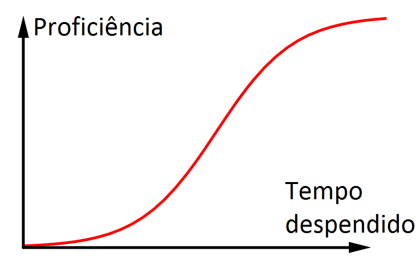
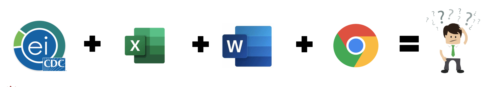
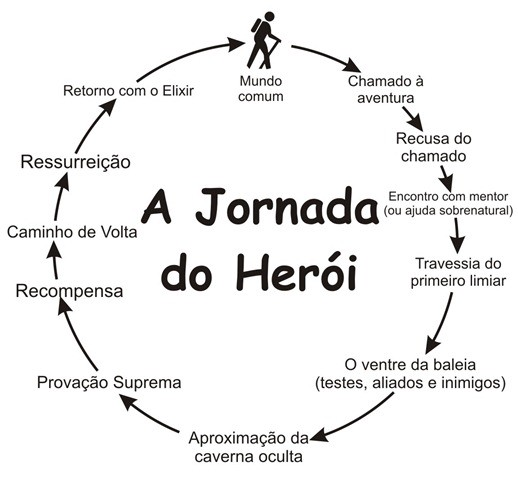
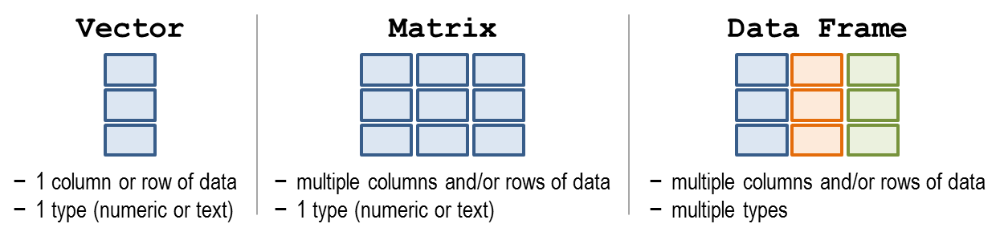
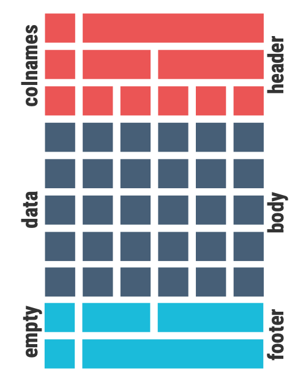
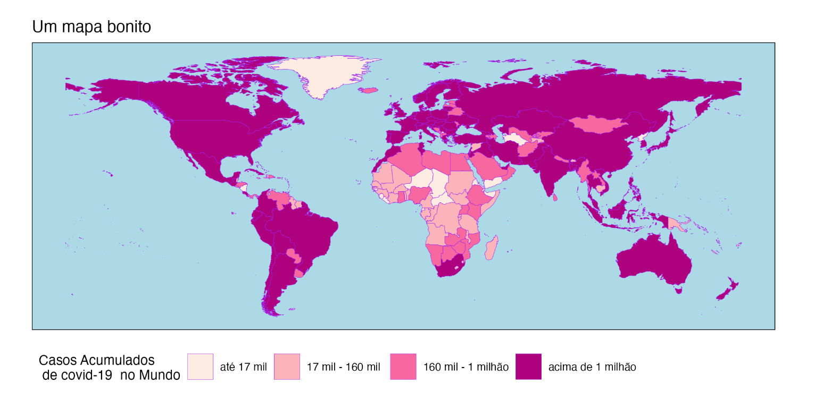
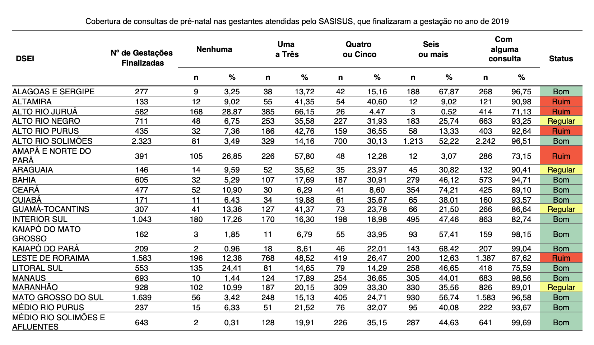
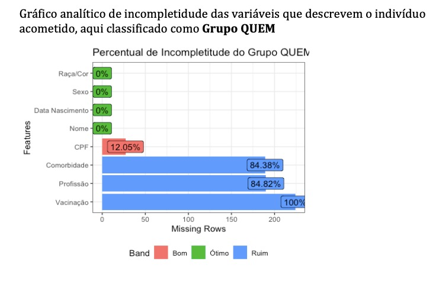
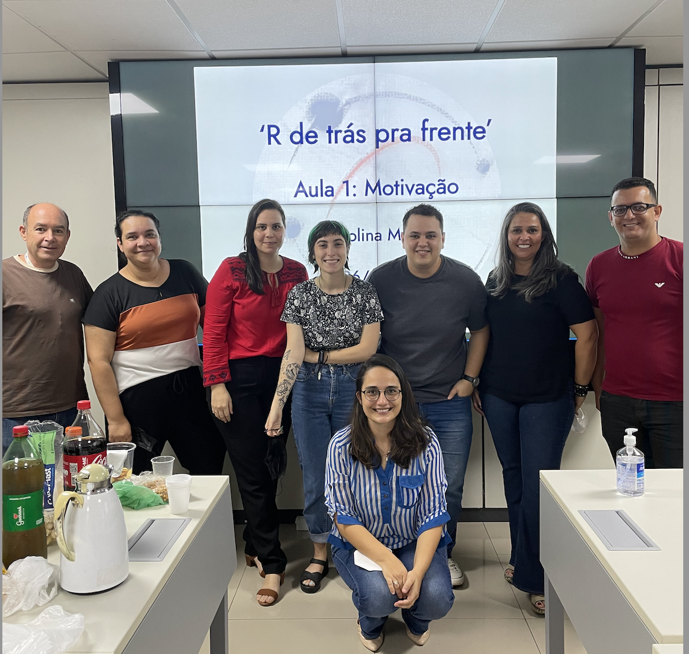

```{r setup, include=FALSE}
options(htmltools.dir.version = FALSE,
        OutDec=",")
knitr::opts_chunk$set(
  fig.width=9, fig.height=3.5, fig.retina=3,
  out.width = "100%",
  cache = FALSE,
  echo = TRUE,
  message = FALSE, 
  warning = FALSE,
  hiline = TRUE
)
```

class: center middle

# UMA BREVE APRESENTAÇÃO DOS AUTORES ...
---
layout: true

---

#### Carolina Musso
<center></center>

*  Bióloga, Dra em Ecologia
*  Estudante de Estatística
*  Pesquisadora Colaboradora
  - Dep. Saúde Coletiva  - UnB
* Servidora Púplica
  - Secretaria da Saúde, Distrito Federal
* Consultora
  - Ministério da Saúde
* [`r fontawesome::fa("linkedin")`](<https://www.linkedin.com/in/carolina-musso-29b627128/>) [`r fontawesome::fa("github")`](<https://github.com/cmusso86>) `r fontawesome::fa("envelope")` cmusso86@gmail.com
  
---

.pull-left[
#### Hudson Fontenelle
<center></center>

*   Biólogo
*   Mestrando em Ecologia (Unicamp)
*   Consultor OPAS
  - PROFESP - Dep. EMSP
  - Ministério da Saúde
  
]

.pull-right[

#### Paola Freitas
<center></center>

* Estudante de biologia
* Bolsista UnB Cerrado
* Bolsista Fiocruz
   PROFESP - Dep. EMSP
  - Ministério da Saúde
]


---
.pull-left[
#### Taynná Almeida
<center></center>

* Dra em Biotecnologia
* Pós-doutora em Ciências da Saúde
* Especialista em Epidemiologia
* Gerente de Projeto
  - Dep. EMSP 
  - Ministério da Saúde

]

.pull-right[
#### Janaina Sallas
<center></center>

* Bióloga, Dra em Saúde Coletiva
* Especialista em Epidemiologia
* Coordenadora Geral  
  - CIEVS-Dep. EMSP
  - Minstério da Saúde
]


---
class: center middle

# INTRODUÇÃO

---

### O Ensino de R para Profissionais de Saúde

- **Necessidade** de dominar ferramentas poderosas.

- No entanto,há o **desafio** pouco tempo para aprender ...

<center></center>

---

# Vigilância a Saúde

*"Processo contínuo e sistemático de coleta, consolidação, análise de dados e disseminação de informações sobre eventos relacionados à saúde, visando o planejamento e a implementação de medidas de saúde pública, incluindo a regulação, intervenção e atuação em condicionantes e e determinantes da saúde, para a proteção e promoção da saúde da população, prevenção e controle de riscos, agravos e doenças"*

---
## Muitas analises

### Pouco tempo de analisalas

<center></center>

* Muito tempo + softwares + profissionais

  - Maior possibilidade de erro
---

# Hello World!

<center></center>

---
# Jornada do Heroi

<center></center>

---

## OBJETIVOS

* Capacitar os proficionais a utilizar o R  

  - Tornando-os autossuficientes  

* Possibilitar a produção de seus primeiros documentos automatizados em Rmarkdown

---
## Bibliografia Principal

  + [The Epi-R Handbook](<https://epirhandbook.com/en/>)  
  
  
  + [R4DS](<https://r4ds.had.co.nz/data-visualisation.html>)  
  
  
  + [Curso-R](<https://livro.curso-r.com>)

---
## IDEIA DO CURSO

* **De Trás-prá-frente**

  - Apresentar as **potencialidades**
  
  - Manipular o código de forma mais **intuitiva**
  
  - Apresentar os conceitos formalmente **posteriormente**
  
  - Ensinar a "se virar"
  
  - Foco na resolução do problema, e não em ser um programador
  
---

class: center middle
# METODOLOGIA
---
## Metodologia

- 7 modulos 

- Aula expositiva **síncrona**

  - Exercício durante a aula
  - Kahoot ao fim da aula

- Exercícios extraclasse

- Fim do modulo com tutoria individual

---
## Módulo 1 

**"Como rodar aquele código que alguém fez pra mim"**

- Executar rotinas já estabelecidas. 

- Compreender e identificar possíveis erros e como corrigi-los. 

- Introdução ao RMarkdown. 

- Conceitos básicos (objetos, vetores, console, data frame) abordados de forma "imersiva".
---
# COMO ERA UM EXERCÍCIO

```{r}
rm(list=ls()) 
# PACOTES ----
if (!require(pacman)) install.packages("pacman")
  pacman::p_load(tidyverse, data.table)
  
# BANCO 
  who_data <- fread("https://covid19.who.int/WHO-COVID-19-global-data.csv")
  
# MANIPULAÇÕES ----
  who_trat <- who_data %>% 
  group_by(Country) %>% 
  summarise(Acumulado=max(Cumulative_cases,
                          na.rm=T)) %>% 
  filter (Acumulado > 10000000) 
```

---
# COMO ERA UM EXERCÍCIO

```{r}
ggplot(who_trat)+
  geom_col(aes(x=Country, y=Acumulado), 
            color="black", fill="orange")+
  coord_flip()+
  theme_classic()
```

---
# Módulo 2 

**"Mas é que eu queria esse gráfico de outra cor"**


<center></center>

---

## Módulo 3 

**"Às vezes devemos dar um passo para trás antes de continuar"**  


<center></center>

---

## Módulo 4 

**“Nada se cria, tudo se transforma”**


<center></center>

---

## Módulo 5 

**"Servidor público adora uma tabela"**

<center></center>

---

## Módulo 6 
**"Tópicos avançados"** 

<center></center>

---
## Módulo 7 

**“Tudo junto misturado: Trabalho final”**


<center></center>

---

### Exemplo 1: A acompanhamento do pré-natal 

<center></center>

---

### Exemplo 2: Qualidade do Banco de covid-19

<center></center>

---
## Obrigada!

<center></center>
