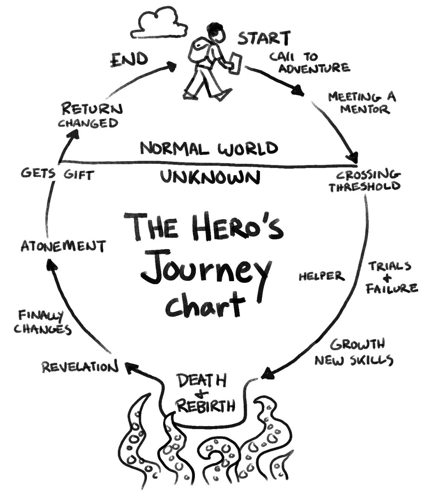
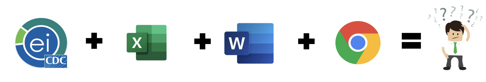

```{r setup, include=FALSE}
options(htmltools.dir.version = FALSE)
knitr::opts_chunk$set(
  fig.width=9, fig.height=3.5, fig.retina=3,
  out.width = "100%",
  cache = FALSE,
  echo = TRUE,
  message = FALSE, 
  warning = FALSE,
  hiline = TRUE
)
```

```{r xaringan-themer, include=FALSE, warning=FALSE}
library(xaringanthemer)
style_duo_accent(
  primary_color = "#1381B0",
  secondary_color = "#FF961C",
  inverse_header_color = "#FFFFFF"
)
```

## Quem sou eu?

.left-column[
<center></center>
]

.right-column[

- Bióloga, doutora em ecologia de plantas &#127793;

- Estatística e Especialista em Ciência de Dados &#128187;

- Servidora da SES/DF : Vigilância Epidemiológica.

- Trabalhando no IPEDF: Estudos Ambientais e Territoriais

- Pesquisadora Colaboradora UnB

- Fã de [Sara's Scribbles](<https://sarahcandersen.com/about>) e outros cartoons

]

.footnote[
**cmusso86@gmail.com** -- [**github**](<https://github.com/cmusso86>)--[**Linkedin**](<https://www.linkedin.com/in/carolina-musso-29b627128>)--
[**lattes**](<http://lattes.cnpq.br/5950109359484071>)
]

---
### Mas o que eu faço mesmo no dia a dia?

--

- Trabalho com R.

--

- Mas peraí, essa apresentação é pra ficar falando de você ou do curso afinal?

<center></center>
---

## Para que uso o R? (Resumidamente)

--

- Análise e Visualização de dados.
- Automatização de processos em R.

--

### A revolução dos dados

> Cinco exabytes de informação foram criados desde o início da civilização até 2003, agora essa mesma quantidade é gerada a cada dois dias, e em ritmo acelerado.

> - Eric Schmidt, CEO Google, 2010
---
## Alguém já usou (ou tentou) o R?

<center></center>
---

## A vida é uma jornada...

(ou melhor, uma jornada atrás da outra...)

[Jornada do Herói](<https://www.ted.com/talks/matthew_winkler_what_makes_a_hero?utm_campaign=tedspread&utm_medium=referral&utm_source=tedcomshare>)

<center></center>


---

### Análise de dados e Saúde

- Carência de (bons!) profissionais.

  - Muito difícil achar a combinação:
    **Conhecimento em saúde + em análise de dados**

<center></center>


---
class: inverse center middle

# Como começar?

---


## Nossa sugestão:


--

- Ao contrário!*

<center></center>


--

- (Se você já estiver acostumado com análise de dados)


## Porque o R?  

<center></center>

---
## Exemplos:

.pull-left[Esta apresentação!

[Livros](<https://r4ds.had.co.nz/data-visualisation.html>)

[Dashboars (Painéis)](<https://gallery.shinyapps.io/cran-gauge/?_ga=2.116423429.227892178.1618785491-1226690963.1617932023>)

[R Gallery](<http://www.r-graph-gallery.com>)

[Blogs](<https://beatrizmilz.com>)]

.pull-right[
<center></center>
]

---
## Outras vantagens

- **Gratuito e *open source* :**

  + *Vai conseguir usar sempre.*
  

- **Um grande processo colaborativo:**

  + *O que você quiser fazer, alguém já tentou e vai te ajudar!*
  

- **"Conversa" com outras linguagens e ambientes:**

  + *Latex, Markdown, html, python, Collab, GitHub, Overleaf...*

- **REPRODUCIBILIDADE DAS SUAS ANÁLISES**

  + *Bom pra você e bom para a ciência!*

---
### Cursos

.pull-left[
- Cursos:

  + [DataCamp](<https://learn.datacamp.com/#>)
  
  + [Coursera](<https://www.coursera.org/>)
  
  + [Udemy](<https://www.udemy.com>)
  
  + [HarvardX](<https://www.edx.org/school/harvardx>)
  
  + [Future Learn](<https://www.futurelearn.com/>)
]
.pull-right[
<center></center>
]
---

## Outras recomendações

#### Livros -> Muitos gratuitos online!

  - [EpiRHandBook](<https://epirhandbook.com/pt>), [R for Excel Users](<https://rstudio-conf-2020.github.io/r-for-excel/>), [RMarkdown](<https://bookdown.org/yihui/rmarkdown/>), ...
  
#### Canais e sites

  + [Marcel Santos](<https://www.youtube.com/channel/UCO6x7sQurFTw0Su0vsexE5g>)
  
  + [@r_descomplicado](<https://www.instagram.com/r_descomplicado/>)
  
  + [Beatriz Milz](<https://beatrizmilz.com>)
  
  + [RLadies](<https://rladies.org/>), [RStudio](<https://www.rstudio.com/>), [Stat Quest](<https://www.youtube.com/watch?v=pYxNSUDSFH4>),  [CheatSheets](<https://www.rstudio.com/resources/cheatsheets/>),  [Reproducible Analysis with R](<https://nceas.github.io/sasap-training/materials/reproducible_research_in_r_fairbanks/>), [Outros Exemplos nestePost](<https://marcoarmello.wordpress.com/2019/06/03/rstats/>), [Statistics by Jim](<https://statisticsbyjim.com>),  [Kaggle](<https://www.kaggle.com>), ...
  
---

### Estudo de caso

- CIEVS

  - Alguém sabe o que é?
  
--

#### Antes

<center></center>

--

#### Agora

<center></center>

---

### Agora

- Envio de banco por email 

- Boletim epidemiológico diário em pdf em um clique

- Matriz de risco

- Otimização do tratamento das planilhas dos laboratórios, API Esus...

--

- **Economia > 60 horas semanais!**

---

# O curso R de Tras para Frente

- Vamos à plataforma!

---
## Bom curso!

<center></center>


