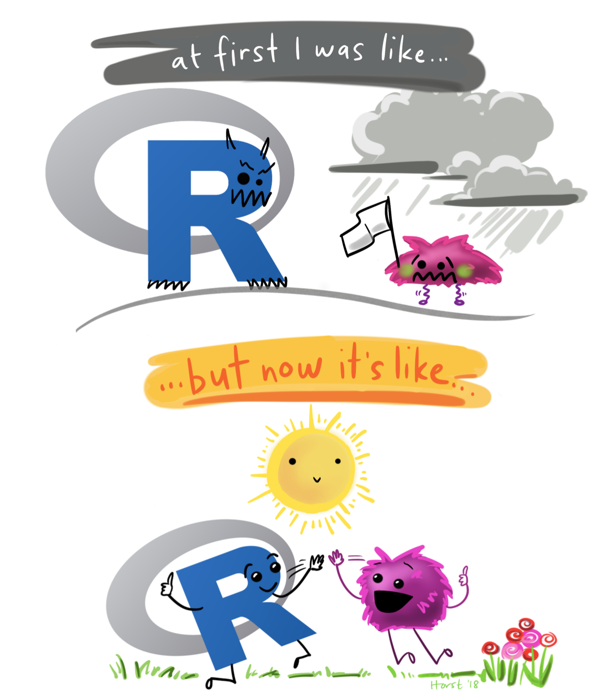
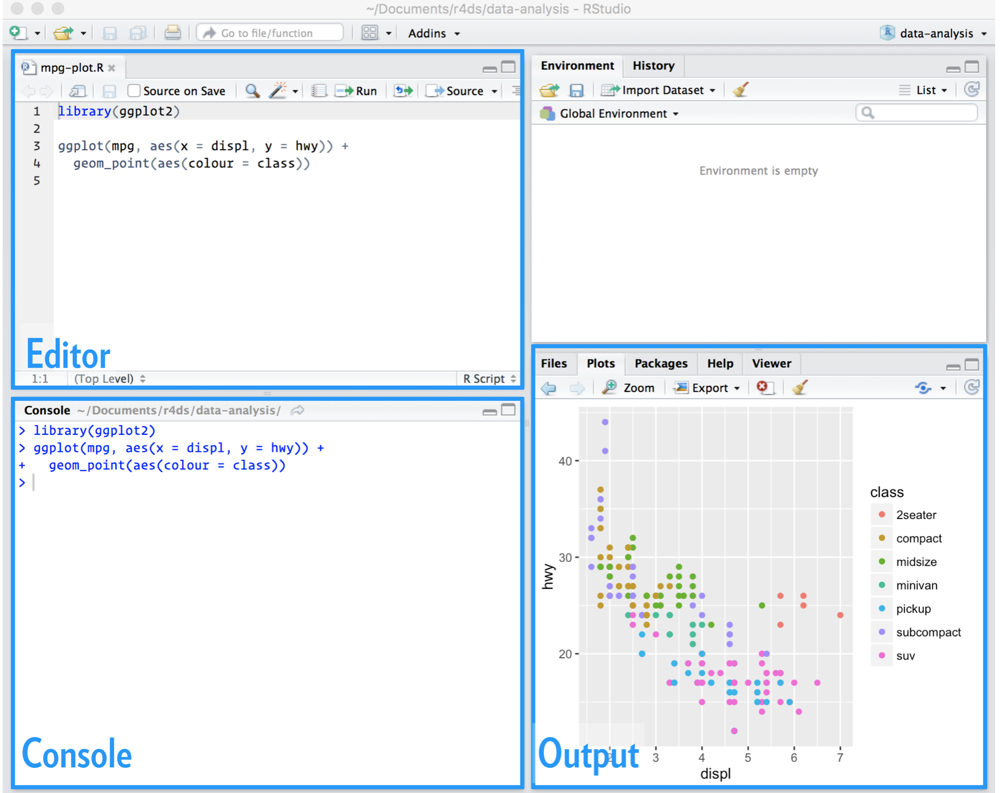
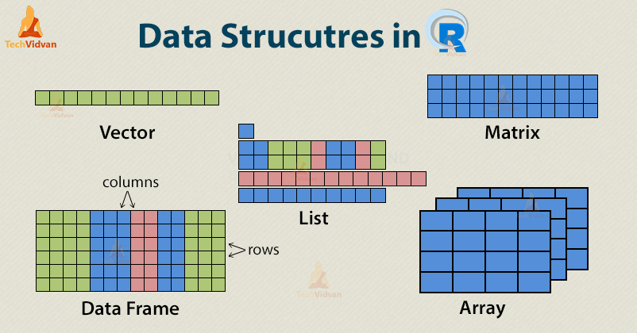
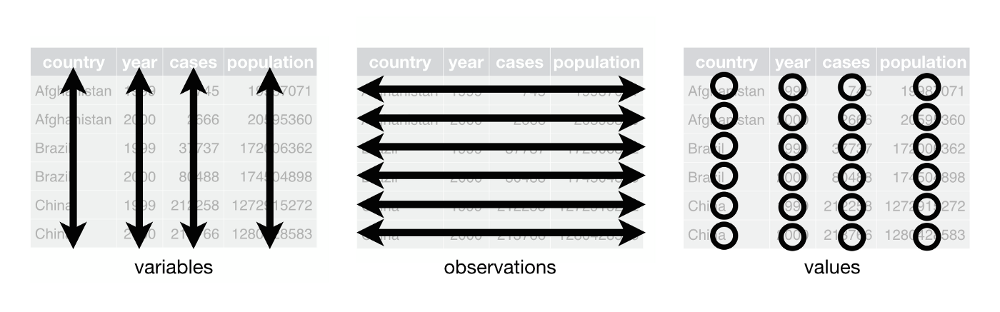

```{r setup, include=FALSE}
options(htmltools.dir.version = FALSE)
knitr::opts_chunk$set(
  fig.width=9, fig.height=3.5, fig.retina=3,
  out.width = "100%",
  cache = FALSE,
  echo = TRUE,
  message = FALSE, 
  warning = FALSE,
  hiline = TRUE
)
```

```{r xaringan-themer, include=FALSE, warning=FALSE}
library(xaringanthemer)
style_duo_accent(
  primary_color = "#1381B0",
  secondary_color = "#FF961C",
  inverse_header_color = "#FFFFFF"
)
```


class: inverse center middle

# Webinar 2:
## Como uma aula de R geralmente começa...

---

## R como uma calculadora

- Todo curso começa assim &#128580; ...
```{r}
1 + 3
34/90
5 < 4
```

---
# Temas de hoje

.left-column[


- Partes do R Studio

- Objetos e funçoes

- Importar dados
]

.right-column[
<center></center> ]
---

# RStudio: **Quatro painéis**

 <center></center>  

-  Tools ->  Global options -> Pane Layout 
  
---

## Funções

- "Funções em programação é um conjunto de instruções para simplificar uma tarefa repetitiva"

```{r}
sqrt(9)
round(3.89, digits = 0 )
round(3.89,  0 )

```
---
## Objetos

- "Um nome que você dá para poder salvar informações"
```{r, eval=FALSE}
raiz_de_nove <- sqrt(9)
raiz_de_nove
```

```{r}
dados_covid <- rio::import("https://srhdpeuwpubsa.blob.core.windows.net/whdh/COVID/WHO-COVID-19-global-table-data.csv")

head(dados_covid, 3)
```

## Objetos: Vetor

  - funçao de concatenar c()
  
  - símbolo de atribuição <- (ou um = também serve)

```{r}
c(1,4,6,7,8) # sem salvar em um objeto

vetor1 <- c(1,4,6,7,8) #salvando em um objeto 

vetor1 #visualizando esse objeto

```

**Atalho no teclado**: Alt - ( ou option - no mac)
```{r}
class(vetor1)
```

---
## Vetor de caracteres: string


```{r}
nomes <- c("Carol", "Otto", "Julio", "Eduardo", "Alvaro")

nomes

class(nomes)
```

---

## Observando os objetos

```{r}
nomes[3]
```

---

## Outros objetos

<center></center>

---

## Matrizes

- "Vetores com duas dimensões"
- Todas as entradas são do mesmo tipo

```{r}
matriz1 <- matrix(1:6, nrow = 2, ncol = 3)

matriz1

```

```{r}
matriz1[2,2]
```

---
### Listas

- "Objetos que podem conter diferentes tipos de objetos"

```{r}
lista1 <- list(c("a", "b", "c"), 
               matrix(1:4, nrow = 2, ncol = 2))
lista1
```

---
### Vamos trabalhar muito com data frames

- **Duas dimensões**
  - linhas: observações
  - colunas: variáveis
    - "tidy"

<center></center>

---
# Vamos conversar?!